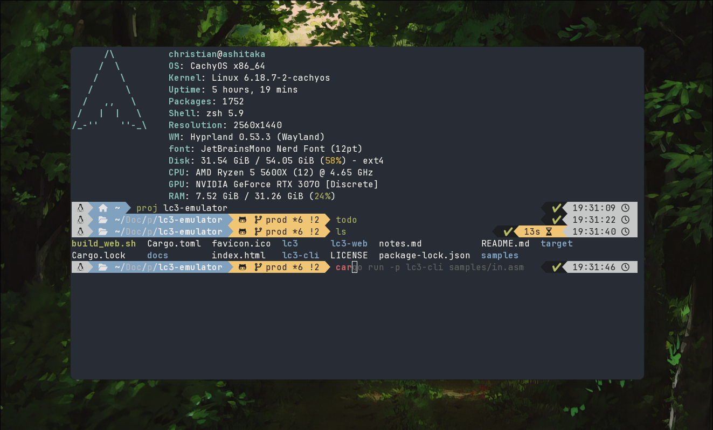

# OVERVIEW
This is a simple, clean, and powerful zsh config.
It assumes the following folders exist in `~/Documents/`:
- `projects/`
- `repos/`
- `notes/`
- `notes/todos`

Don't worry, following the setup process will automatically make these folder for you
(if they dont already exist)

# NOTABLE FEATURES
This list is not comprehensive, but here are some heightlights:

- Syntax hightlighting
- Autocomplete
- `cd` is replaced with `pushd`, which allows for going back to previous directories with `popd`
- `proj` command goes to the project directory
    - `proj <proj_name>` goes to the specified project
- `todo` command automatically creates a todo file for the day in the todos directory, and opens it in neovim.
- `notes` command take you to the notes directory
- `repos` command takes you to the repos directory
- `v` is neovim

# SETUP
Before use, ake sure the following packages are in your `$PATH`
- `fastfetch`
- `nvim`
- `/usr/bin/dircolors` (Optional, and very likely already exists)

0. Remove any previous config
> [!WARNING]
> This will destroy any previous config. Please back up before doing this.
```zsh
rm -rf ~/.config/zsh/
rm -f ~/.zshrc
```

1. Clone repo into `.config/zsh` and create a symbolic link to `~/.zshrc`
```zsh
git clone https://github.com/ChristianStout/zsh-config.git ~/.config/zsh
ln -s ~/.config/zsh/.zshrc ~/.zshrc
```

2. Run setup script
This is will install all plugins, and run the `powerlevel10k` theme setup
```zsh
cd ~/.config/zsh/
chmod +x *.sh 
./setup.sh
```

